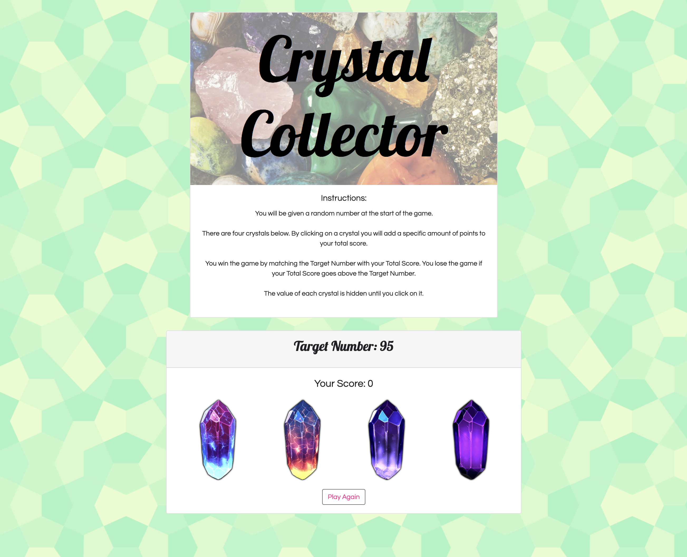

# Crystal Collector
This application was built as part of the UCF Coding Bootcamp and was authored by Celisse Dones.

# Overview
Crystal Collector challenges the user to reach the randomly generated Target Number, by clicking on the crystals. Each crystal is assigned a randomly generated value each time the game is played. Reach the target number without going over to win the game. Otherwise, start over and play again. ⭐️

# Screenshot

# Technologies Used
<ul>
    <li>HTML5</li>
    <li>Bootstrap CSS</li>
    <li>JavaScript</li>
    <li>jQuery</li>
</ul>